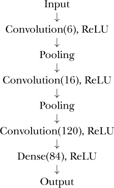

# Convolutional Neural Network (CNN)


```python
def create_cnn_model():
    model = Sequential([
        Conv2D(32, (3, 3), activation='relu', input_shape=(32, 32, 3)),
        MaxPooling2D((2, 2)),
        Conv2D(64, (3, 3), activation='relu'),
        MaxPooling2D((2, 2)),
        Flatten(),
        Dense(472, activation='relu'),
        Dense(10, activation='softmax')
    ])
    model.compile(optimizer='adam', loss='categorical_crossentropy', metrics=['accuracy'])
    return model
```


## Steps

- Image channels
- Convolution
- Pooling
- Flattening
- Full connection

### 1. Image channels

- Demo: [image](./img/apple.jpg) to [RGB](https://onlinetools.com/image/separate-image-color-channels)


### 2. Convolution

**Feature maps**


**Kernels**


**Striding**


**Padding**


**Convolutions applied over the RGB channels**


**Convolutions applied to more than one filter**


### 3. Pooling: min, max, and average pooling

**Max pooling applied to a filter of size 2 (2x2) and stride=1**


**Another example**


### 4. Flattening


### 5. Full connection


### 6. CNN Architecture



**Types of convolutional neural networks**

- AlexNet
- VGGNet
- GoogLeNet
- ResNet
- ZFNet
<!--  -->

-------
## Ref

- [Introduction to convolutional neural networks](https://developer.ibm.com/articles/introduction-to-convolutional-neural-networks/?mhsrc=ibmsearch_a&mhq=convolutional%20neural%20networks%26quest%3B)
- Other:
  - [How do convolutional neural networks work?](https://www.ibm.com/topics/convolutional-neural-networks)
  - Books:
    - Deep Learning with Python, Second Edition, By Francois Chollet
    - Deep Learning from Scratch, By Seth Weidman