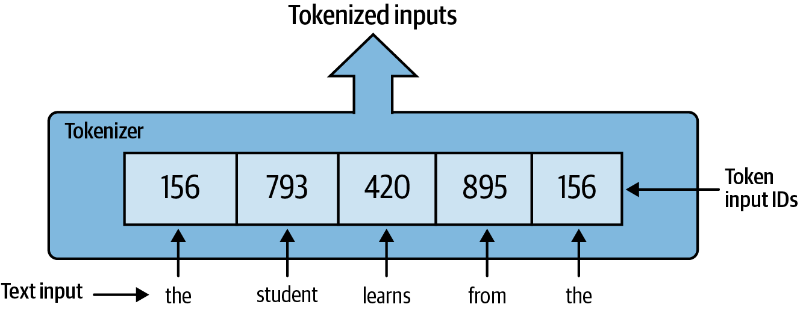
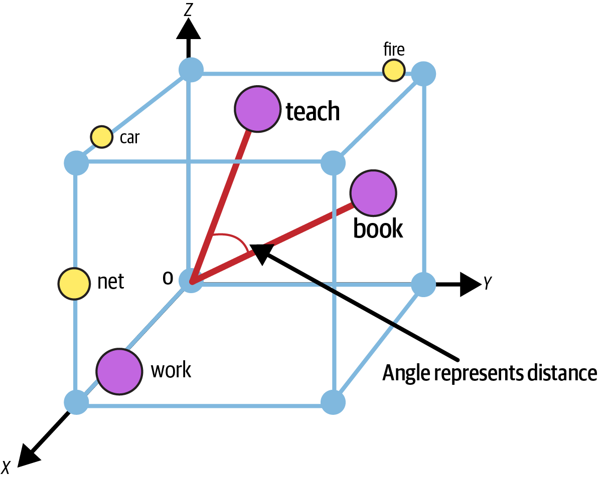
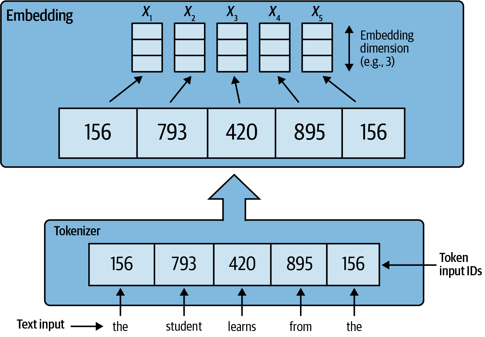
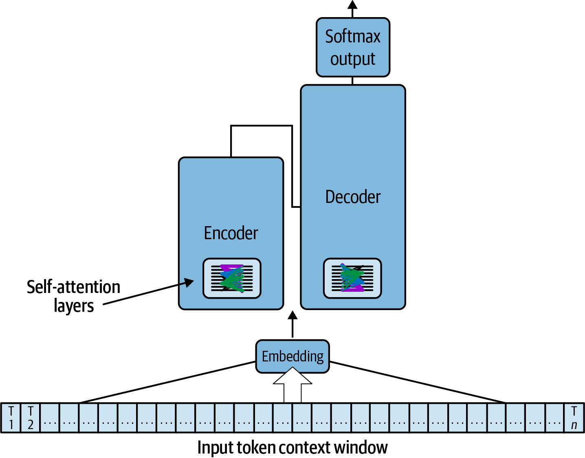
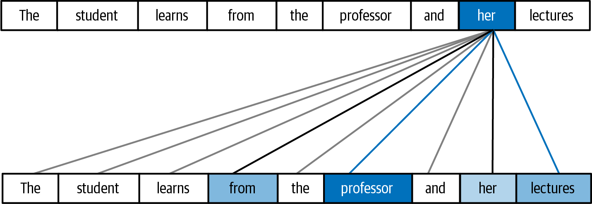
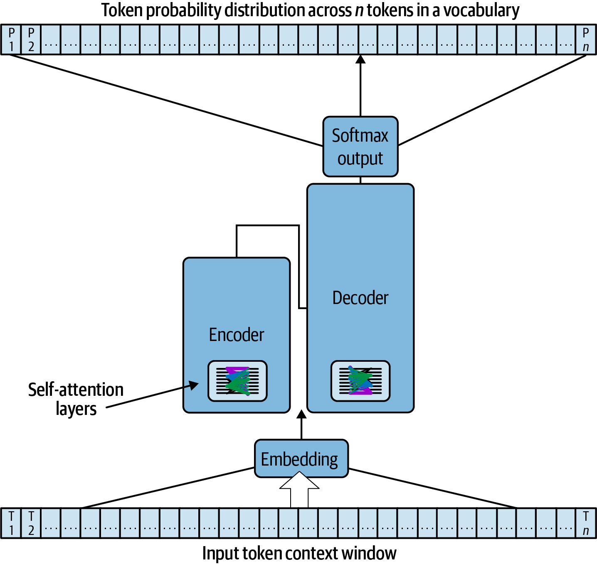
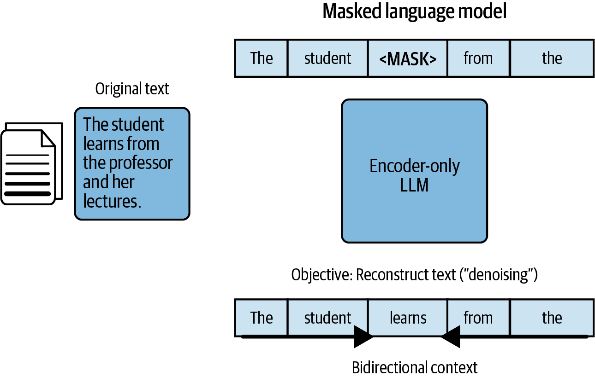
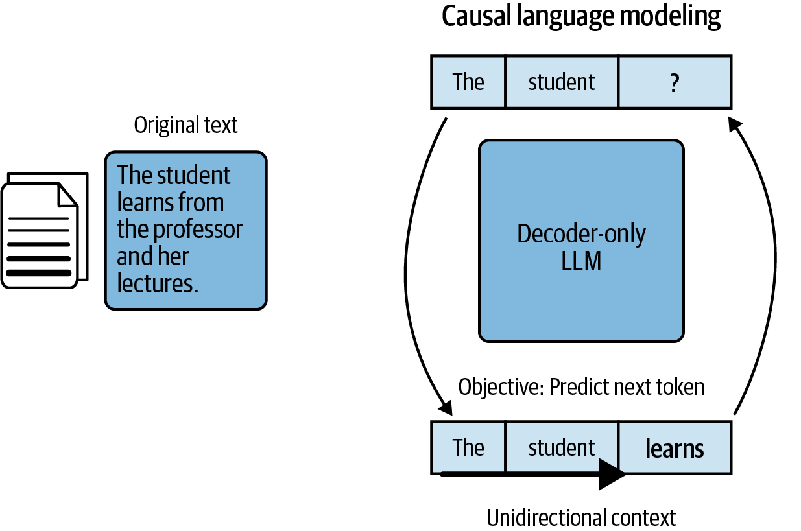
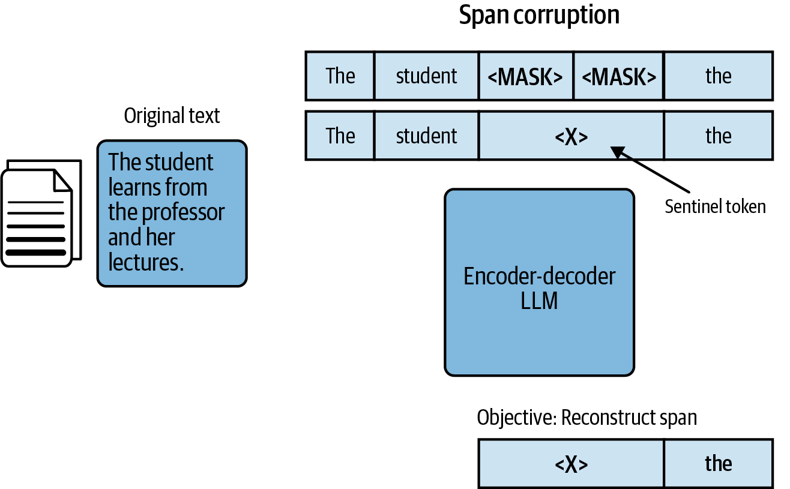

# Transformers

### Intro

- [Notebook](https://github.com/jeffheaton/t81_558_deep_learning/blob/master/t81_558_class_11_01_huggingface.ipynb)

### Tokenizers

- [Notebook](https://github.com/jeffheaton/t81_558_deep_learning/blob/master/t81_558_class_11_02_tokenizers.ipynb)

### Datasets

- [Notebook](https://github.com/jeffheaton/t81_558_deep_learning/blob/master/t81_558_class_11_03_hf_datasets.ipynb)

### Models 

- [Notebook](https://github.com/jeffheaton/t81_558_deep_learning/blob/master/t81_558_class_11_04_hf_train.ipynb)

### Embedding Vectors

- [Notebook](https://github.com/jeffheaton/t81_558_deep_learning/blob/master/t81_558_class_11_05_embedding.ipynb)

### Transformer Architecture

### Self-Attention

### Softmax Output

### Types of Transformer-Based Foundation Models

- Encoder-only 

- Decoder-only models

- Encoder-decoder models

### Ref

- [Generative AI on AWS](https://learning.oreilly.com/library/view/generative-ai-on/9781098159214/ch03.html)
- Articles
  - [The Illustrated Transformer](https://jalammar.github.io/illustrated-transformer/)
  - [Understanding Attention In Deep Learning](https://towardsdatascience.com/attaining-attention-in-deep-learning-a712f93bdb1e)
  - [Transformers or as I like to call it Attention on Steroids](https://towardsdatascience.com/transformers-89034557de14)
  - [Word2Vec](https://towardsdatascience.com/nlp-101-word2vec-skip-gram-and-cbow-93512ee24314)
  - [https://github.com/jeffheaton/t81_558_deep_learning](https://github.com/jeffheaton/t81_558_deep_learning/blob/master/t81_558_class_11_01_huggingface.ipynb)